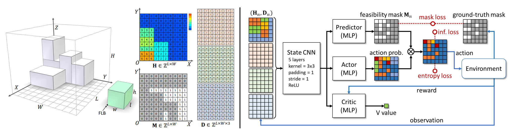

# Online 3D Bin Packing with Constrained Deep Reinforcement Learning




## Online-3D-BPP-DRL

Video link of our project: [YouTube](https://www.youtube.com/watch?v=hBzZA_21G3M&t=6s), [bilibili](https://www.bilibili.com/video/BV1st4y1H7kU/?vd_source=b1e4277847248c95062cf16ab3b58e73)

This repository contains the implementation of the paper [Online 3D Bin Packing with Constrained Deep Reinforcement Learning](https://arxiv.org/pdf/2006.14978.pdf).


## Install

```
To make this project work, there are two things you should do:
* Install Python packages in 'requirements.py' (by 'pip install -r requirements.txt').
* (This code works on Python 3.7)
```

## Run
We provide a unified interface in 'main.py'. There are examples of running our project.

For training：
```
Example: Train a new model on sequences generated randomly.
You can run 'python main.py --mode train --load-model False --use-cuda --item-seq rs'.
It will take about one day to get a model with satisfying performance.

You can run 'python main.py --help' for some information of common parameters.
There are many other parameters of our project in 'config.py', and all of them are given default values. You can change it if you like.
```

For test:
```
Example:
If you want to test a model trained on sequences generated by CUT-2 Algorithm(get more details in our article).
You can run 'python main.py --mode test --load-model True --use-cuda --data-name cut_2.pt --load-name default_cut_2.pt'.

If you want to see how the model works in a lookahead setting,
You can run 'python main.py --mode test --load-model True --use-cuda --data-name cut_2.pt --load-name default_cut_2.pt --preview x', x is the lookahead number.

Codes of user-study applications, multi-bin algorithm, and MCTS for comparison are also provided,
Please check 'user_study/', 'multi_bin/', 'MCTS/' for details.
```

## Tips
```
* Different input state sizes need different kinds of CNN for encoding, you can adjust the network architecture in ./acktr/model.py to satisfy your needs. 

* Predicted mask is mainly for reducing MCTS computing costs. If you only need the BPP-1 model, you can replace the predicted mask with a ground-truth mask during the training and it will be easy for training.

* If you relax the constraint of stability rules, you may get a better result, but it may be dangerous in practice.

* The computing overhead of our implementation is sensitive to the length of the network layer, you should avoid a large network layer appearing in your network architecture. 

* Bin packing problem's difficulty is related to its item set. The trained model's performance is also affected by it.
```

## Statement
```
Hang Zhao and Qijin She are co-authors of this repository.

Some codes are modified from the open-source project 'pytorch-a2c-ppo-acktr-gail' (https://github.com/ikostrikov/pytorch-a2c-ppo-acktr-gail).
```

## License
```
Note that this source code is released only for academic use. Please do not use it for commercial purposes without authorization of the authors. The method is being patent protected. For commercial use, please contact Kai Xu (kevin.kai.xu@gmail.com).
```

## Citation

If you are interested, please cite the following paper:

```shell
@inproceedings{DBLP:conf/aaai/ZhaoS0Y021,
  author    = {Hang Zhao and
               Qijin She and
               Chenyang Zhu and
               Yin Yang and
               Kai Xu},
  title     = {Online 3D Bin Packing with Constrained Deep Reinforcement Learning},
  booktitle = {Thirty-Fifth {AAAI} Conference on Artificial Intelligence, {AAAI}
               2021, Thirty-Third Conference on Innovative Applications of Artificial
               Intelligence, {IAAI} 2021, The Eleventh Symposium on Educational Advances
               in Artificial Intelligence, {EAAI} 2021, Virtual Event, February 2-9,
               2021},
  pages     = {741--749},
  publisher = {{AAAI} Press},
  year      = {2021},
  url       = {https://ojs.aaai.org/index.php/AAAI/article/view/16155},
  timestamp = {Wed, 02 Jun 2021 18:09:11 +0200},
  biburl    = {https://dblp.org/rec/conf/aaai/ZhaoS0Y021.bib},
  bibsource = {dblp computer science bibliography, https://dblp.org}
}
```
